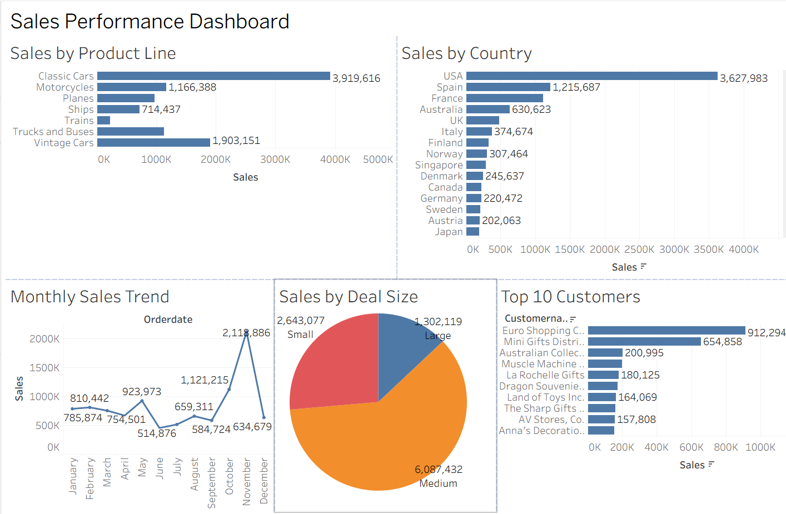

# Elevate Labs - Task 2: Data Visualization and Storytelling

## Objective

Create an interactive sales dashboard using Tableau to visualize sales data and derive business insights.

---

## Dataset

- **Dataset Name:** `sales_data_sample.csv`
- **Tool Used:** Tableau Desktop

---

## Dashboard Visualizations

- 📊 Sales by Product Line
- 🌍 Sales by Country
- 🥧 Sales by Deal Size
- 📈 Monthly Sales Trend
- 🏆 Top 10 Customers

---

## Dashboard Preview



---

## Business Insights

- Classic Cars generated the highest sales among all product lines.
- USA recorded the highest overall sales compared to other countries.
- Medium-sized deals contributed the highest revenue.
- Sales peaked during November, indicating strong seasonal performance.
- Euro Shopping Channel was the highest revenue-generating customer.

---

## Files Included

- `Task_2_Sales_Dashboard.twbx` – Tableau Packaged Workbook
- `sales_data_sample.csv` – Source Dataset
- `dashboard.png` – Dashboard Screenshot

---

## Tools Used

- Tableau Desktop
- CSV Dataset
- GitHub

---

## Author

**Srivant M

---

## Repository Contents

```
📂 Elevate-Labs-Task-2-Data-Visualization
│── README.md
│── Task_2_Sales_Dashboard.twbx
│── sales_data_sample.csv
└── dashboard.png
```

---

## Conclusion

This dashboard provides an interactive overview of sales performance across product lines, countries, customers, deal sizes, and monthly trends. It helps identify top-performing business areas and supports data-driven decision-making.
